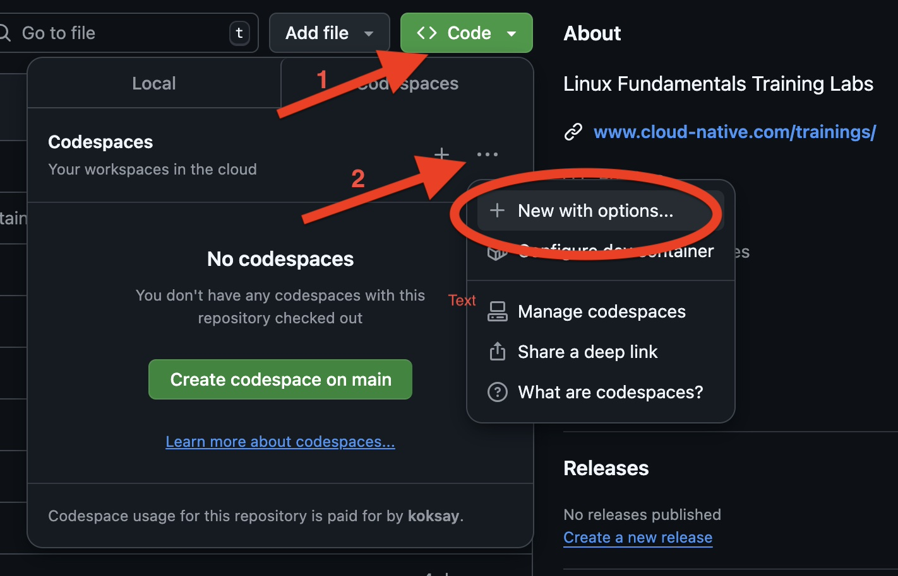
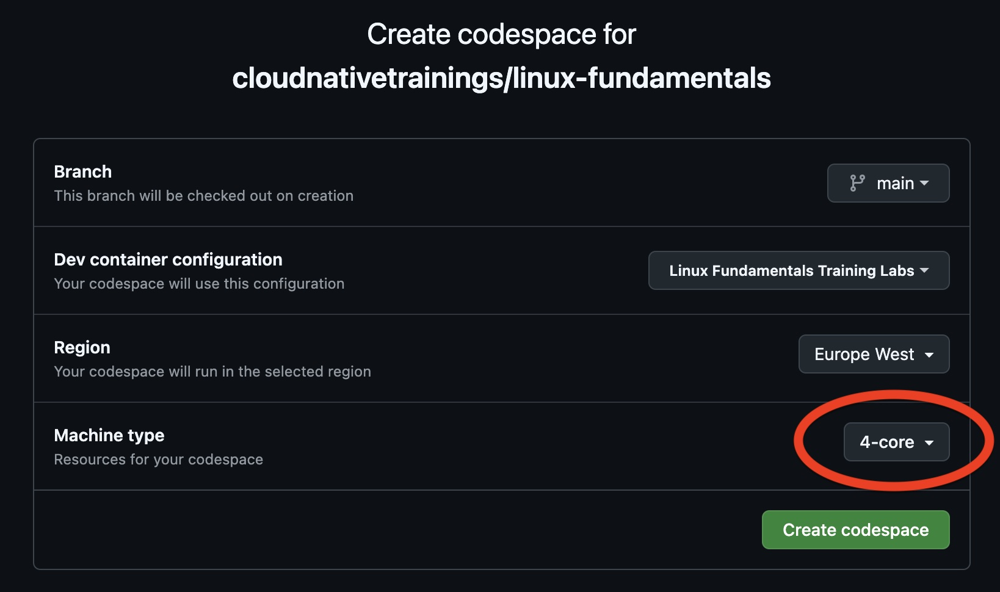

# Linux Fundamentals Training Labs

## Setup training environment

This repository is designed to work with GitHub Codespaces (hence devcontaners).

Make sure that you start the codespaces, make sure you select `4 cores`:





Please run the `pre-checks.sh` script to make sure that all required components are running:

```bash
./pre-checks.sh
```

Wait until the setup is ready, and start with the [01_hello-linux](./01_hello-linux/README.md) lab.
